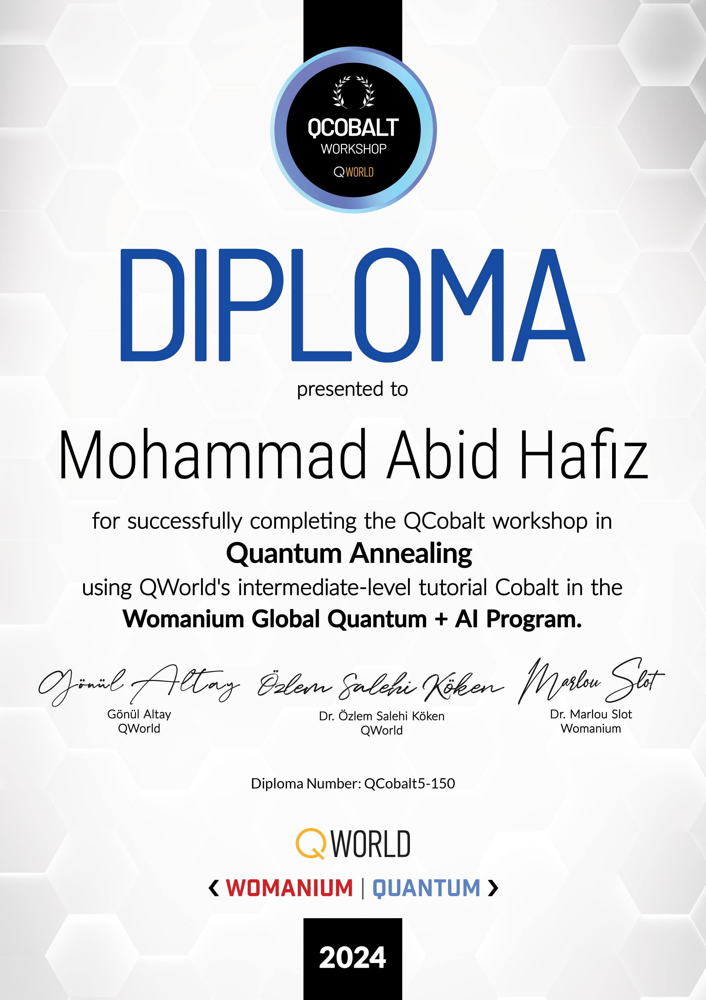

**Project: Educational material development for quantum annealing**

**Assignment**
added to the folder 

**Description:** The aim of the project is to develop new material to teach quantum annealing (QA). The material will start with the theory behind (QA) and continue with examples.

